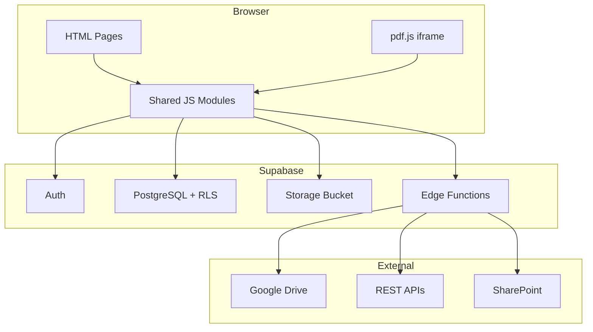

# Architecture Overview

approveDoc is a **multi-tenant, single-page-application-style** web app built with plain HTML, vanilla JavaScript, and Supabase as the backend. There is no build step, no frontend framework, and no server-side rendering.

## High-level architecture

## Key design decisions

### No build step
All JavaScript is plain vanilla ES6+. No TypeScript, no bundler, no NPM for the frontend. This keeps the deployment pipeline simple — a zip file extracted to an IIS folder is all that's needed.

### Multi-tenancy via `organisation_id`
Every approveDoc table carries an `organisation_id` FK. Supabase Row Level Security policies enforce that users can only access data belonging to their own organisation. Super admins can switch between organisations via a session-scoped switcher.

### Auth via Supabase JWT
Supabase handles authentication. The JWT access token is stored in localStorage under the key `app_session` and restored on every page load via `sb.auth.setSession()`. All Supabase API calls are authenticated with this token via an explicit `Authorization` header patch (see [Cross-Domain Compatibility](cross-domain.md)).

### Self-hosted pdf.js
The PDF viewer uses a self-hosted copy of pdf.js loaded in an `<iframe>`. This allows CSS injection into the iframe to customise the toolbar without CORS restrictions. The PDF itself is always fetched to a blob URL first, bypassing pdf.js's URL validation.

### Edge Functions for privileged operations
Operations that require service-role access (user creation, external document proxying) are handled by Supabase Edge Functions (Deno TypeScript). The browser never holds the service role key.
