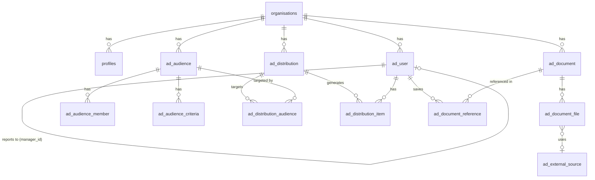

# Database Schema

## Core tables (shared infrastructure)

| Table | Purpose |
|---|---|
| `auth.users` | Supabase built-in; all authenticated users |
| `organisations` | Top-level tenant — everything scoped to an org |
| `profiles` | Extends `auth.users`; display name, role, avatar, preferences (JSONB) |

## approveDoc tables

### User & Organisation

| Table | Purpose |
|---|---|
| `ad_user` | Per-org user extending `auth.users`; job title, department, country, manager hierarchy |
| `ad_department` | Lookup: departments |
| `ad_job_role` | Lookup: job roles |
| `ad_location` | Lookup: locations |
| `ad_country` | Reference: ISO countries (RLS: read-only for authenticated users) |
| `ad_language` | Reference: ISO languages (RLS: read-only for authenticated users) |

### Documents

| Table | Purpose |
|---|---|
| `ad_category` | Document categories (Policy, Procedure, Guidance, Form, Other) |
| `ad_document` | Document metadata (name, description, category) |
| `ad_document_file` | File record; storage path or external source reference |
| `ad_external_source` | External repository connection config (Vault credential reference) |
| `ad_document_reference` | Documents saved to a user's reference library |

### Distribution & Compliance

| Table | Purpose |
|---|---|
| `ad_audience` | Named user groups (`FIXED` or `CRITERIA`) |
| `ad_audience_member` | Explicit members of a FIXED audience |
| `ad_audience_criteria` | Criteria rules for a CRITERIA audience |
| `ad_distribution` | A distribution: document → audiences, with dates and warnings |
| `ad_distribution_audience` | Many-to-many: distribution ↔ audience |
| `ad_distribution_item` | One per user per distribution; tracks status |

## Distribution item status values

| Status | Meaning |
|---|---|
| `PENDING` | Awaiting action, within due date |
| `OVERDUE` | Awaiting action, past due date |
| `APPROVED` | Acknowledged by the user |
| `REJECTED` | Rejected by the user (with reason) |
| `REFERENCE` | Acknowledged and saved to reference library |

## ad_document_file source types

| `source_type` | Storage |
|---|---|
| `SUPABASE` | Supabase storage bucket (default) |
| `URL` | Direct download URL (proxied via edge function) |
| `REST` | REST API endpoint with optional auth |
| `SHAREPOINT` | Microsoft SharePoint / Graph API *(planned)* |
| `ONBASE` | Hyland OnBase REST API *(planned)* |

## Entity relationships

