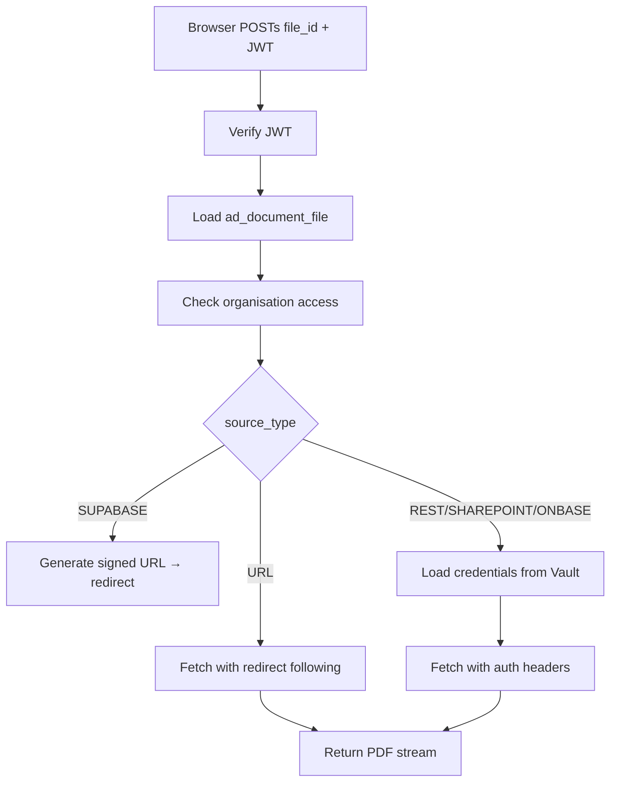

# fetch-document Edge Function

**Endpoint:** `POST /functions/v1/fetch-document`  
**Auth:** JWT required  
**Body:** `{ "file_id": "<ad_document_file.id>" }`

Proxies document retrieval for non-Supabase sources. The browser never makes direct requests to external systems — all auth credentials stay server-side.

## Flow



## Source type routing

=== "SUPABASE"
    Generates a short-lived signed URL and returns a 302 redirect. The browser follows the redirect directly to Supabase storage.

=== "URL"
    Fetches the URL, following redirects manually (see Google Drive below). Returns the PDF as a stream.

=== "REST / SHAREPOINT / ONBASE"
    Looks up `ad_external_source` for auth config. Reads credentials from Supabase Vault. Builds request headers based on `auth_type`:

    | `auth_type` | Header |
    |---|---|
    | `BEARER` | `Authorization: Bearer {token}` |
    | `API_KEY` | `{auth_header_name}: {key}` |
    | `BASIC` | `Authorization: Basic {base64(user:pass)}` |
    | `OAUTH2` | `Authorization: Bearer {token}` |

## Google Drive handling

Google Drive sharing URLs (`uc?export=download&id=...`) sometimes return an HTML virus-scan confirmation page instead of the PDF (typically for files over ~25MB). The function handles this automatically:

1. Follows redirects manually (up to 8 hops)
2. Detects HTML response on a drive.google.com URL
3. Extracts the `confirm=` token from the HTML
4. Retries with `&confirm={token}` appended to the URL

No user interaction required.

## Credentials security

Credentials for external sources are stored in **Supabase Vault**, never in `ad_document_file` or `ad_external_source` directly. The function reads them at request time via:

```ts
const { data: secret } = await adminClient
  .schema('vault').from('decrypted_secrets')
  .select('decrypted_secret')
  .eq('id', src.auth_secret_id)
  .single();
```
