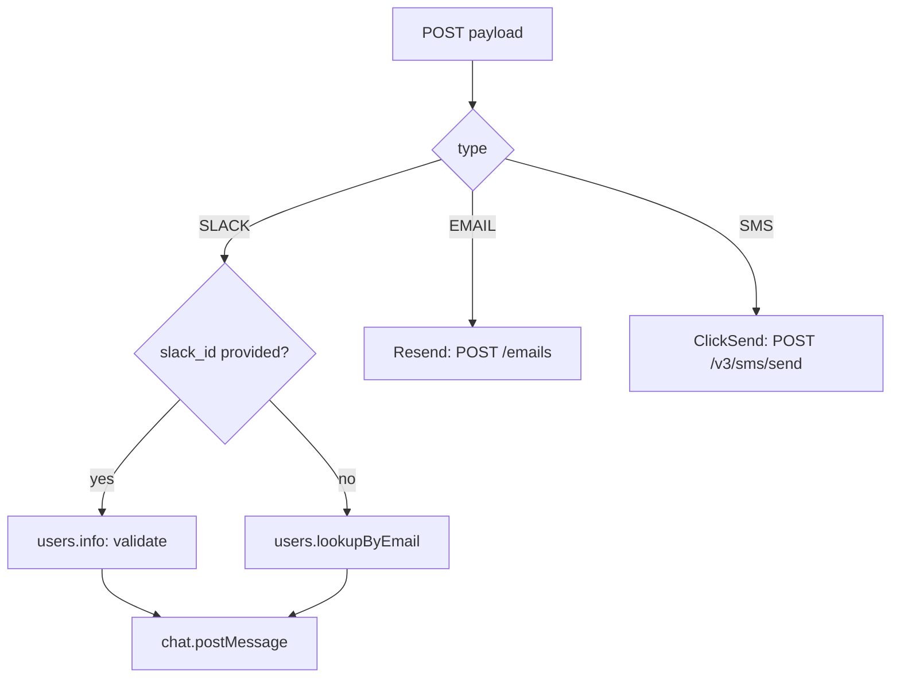

# send-notification-direct Edge Function

!!! warning "Prototype, dev only"
    Deployed to the dev Supabase project (`mimqaklxfmdjlkadjxoh`) only. Not deployed to production, not wired into the nightly cron. See [Notifications](../features/notifications.md) for the full design and how this compares to the Make.com alternative.

**Endpoint:** `POST /functions/v1/send-notification-direct`
**Auth:** JWT required (send the anon key as `Authorization: Bearer <anon key>` — same as any other client call, no user session needed)
**Body:** see [shared request contract](../features/notifications.md#shared-contract)

In-house alternative to the Make.com webhook scenario — calls Slack, Resend (email), and ClickSend (SMS) directly instead of proxying through Make.

## Flow



## Required secrets

Set in Supabase → dev project → Edge Functions → Manage secrets. Read live at request time — no redeploy needed when they change.

| Secret | Source |
|---|---|
| `SLACK_BOT_TOKEN` | A dedicated Slack app ("approveDoc Notifications"), built from scratch specifically for this — kept separate from the app behind Make's Slack connection. Bot scopes: `chat:write`, `users:read`, `users:read.email` |
| `RESEND_API_KEY` | Resend dashboard → API Keys |
| `RESEND_FROM_EMAIL` | Any address on a verified Resend domain, e.g. `approveDoc <notifications@ionetiq.info>` — no real mailbox needed |
| `CLICKSEND_USERNAME` / `CLICKSEND_API_KEY` | ClickSend dashboard → Account → API Credentials |

If a channel's secrets aren't set, that channel responds with `{"status":"error","error":"<SECRET_NAME> is not configured"}` rather than failing silently.

## Setup gotcha: Slack Messages Tab

A Slack app built from scratch has its **Messages Tab disabled by default**. `chat.postMessage` to a user fails with:

```json
{ "success": false, "status": "error", "error": "Failed to send Slack message: messages_tab_disabled" }
```

Fix: **App Home → Show Tabs → Messages Tab** (enable), then tick "Allow users to send messages from the messages tab". Takes effect immediately — no reinstall or new token required.

## Error detail

Every failure path returns the real provider error text, not a generic message:

```json
{ "success": false, "status": "failure", "error": "slack_id is not a valid Slack user: user_not_found" }
{ "success": false, "status": "error", "error": "Failed to send SMS: {\"http_code\":400,...}" }
```

This was added after an initial version that mirrored the Make scenario's fixed-string errors — those made the `messages_tab_disabled` issue above much harder to diagnose than it needed to be.

## Slack DM mechanics

There's no separate "raw" bot-to-person messaging mode in Slack distinct from the Messages Tab conversation — `chat.postMessage` to a user ID *is* what shows up as a DM from the app in the user's sidebar. The Messages Tab setting above is a one-time prerequisite for that to be allowed at all, not an alternative delivery method.
