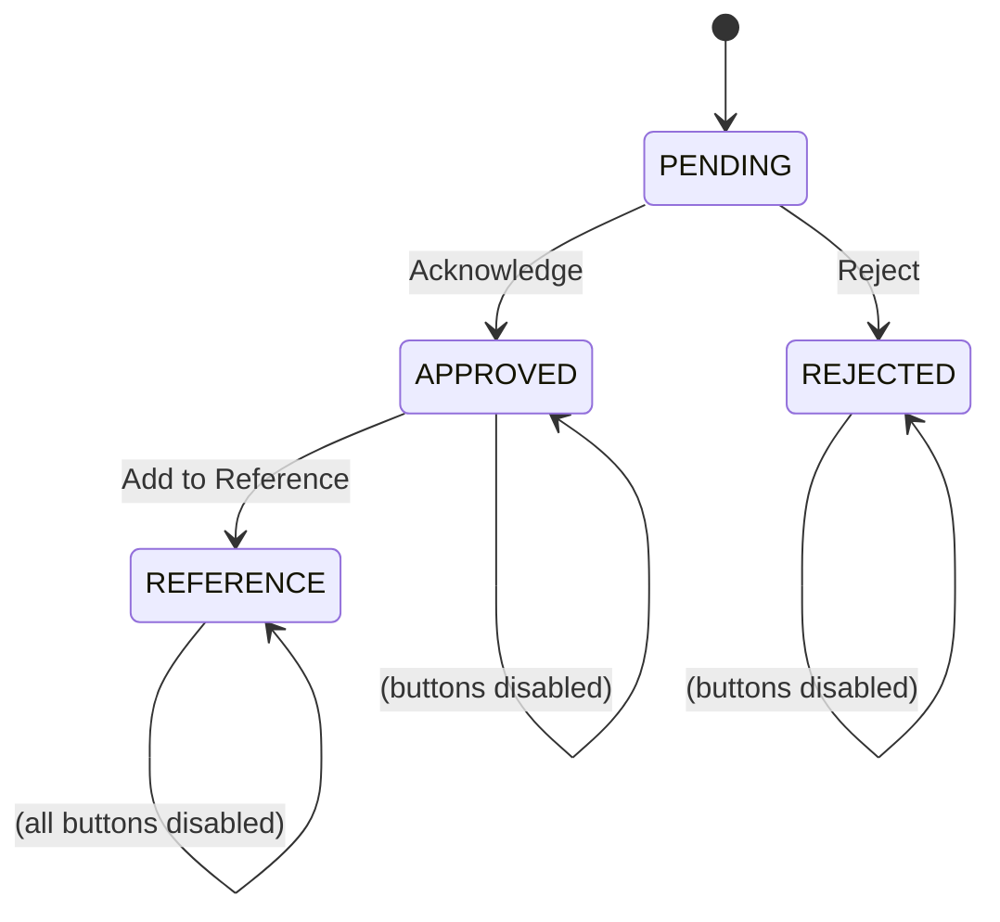

# Acknowledge

**File:** `pages/testing/acknowledge.html`

Full-page document viewer + action panel for a single distribution item.

## URL

```
acknowledge.html?item={distrib_item_id}
```

## Actions

| Action | DB changes |
|---|---|
| **Acknowledge** | `status = 'APPROVED'`, `acknowledged = true`, `acknowledged_date = today` |
| **Reject** | Prompts for reason. `status = 'REJECTED'`, `rejected = true`, `rejected_reason = ...` |
| **Add to Reference** | Inserts `ad_document_reference` row. `status = 'REFERENCE'` |

## Button states



- **Acknowledge** and **Reject** are disabled once any action is taken
- **Add to Reference** is disabled until `status === 'APPROVED'`
- Once `status === 'REFERENCE'`, all three buttons are disabled

## PDF loading

Checks `source_type` on the file record:

- `SUPABASE` → signed URL → blob
- Other → `POST /functions/v1/fetch-document` with user's JWT

## CSS injection

After the pdf.js iframe loads, `injectPdfStyles()` hides the same buttons as the Documents page viewer (print, download, annotation editors, overflow menu, separators, rotate). See [PDF Viewer](../guides/pdf-viewer.md).
