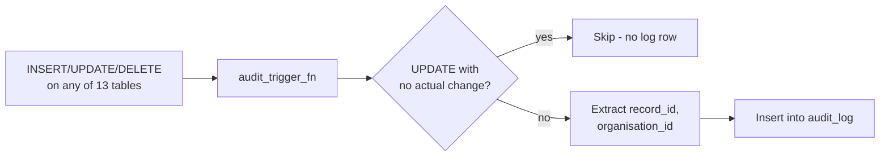

# Audit Trail

Automatic, trigger-based change history across the core compliance tables — every insert/update/delete is captured without any application code having to remember to log it.

## How it's captured

A single generic trigger function, `audit_trigger_fn()`, installed on 13 tables:

```
ad_location, ad_department, ad_category, ad_job_role,
ad_document, ad_document_file,
ad_audience, ad_audience_member, ad_audience_criteria,
ad_distribution, ad_distribution_audience, ad_distribution_item,
ad_document_reference
```

On every `INSERT`/`UPDATE`/`DELETE`, it writes one row to `audit_log`:

| Column | Meaning |
|---|---|
| `action` | `INSERT` \| `UPDATE` \| `DELETE` |
| `table_name` | Which table changed (`TG_TABLE_NAME`) |
| `record_id` | The row's primary key — derived by stripping the `ad_` prefix and appending `_id` (e.g. `ad_location` → `location_id`), falling back to `id`, then `'(unknown)'` |
| `old_values` / `new_values` | Full row as JSONB, before/after |
| `user_id` | `auth.uid()` at time of change |
| `organisation_id` | Pulled from the row's own `organisation_id` column where present |

No-op updates (row unchanged) are skipped rather than logged — the trigger compares old vs. new JSONB and returns early if identical.



## Retention

`organisations.audit_retention_months` (default `36` / 3 years), per-org. The admin UI's "Archive" action moves records older than this out of the live table — see below.

!!! note "Archiving: schema drift between the incremental migration and full schema"
    The admin UI (`audit.html`) references an `audit_log_archive` table and an archive action that moves old records into it. That table is defined in `00-FULL-SCHEMA.sql` (the from-scratch rebuild script) but **not** in `25-audit-trail.sql` (the incremental migration that actually ran). Worth reconciling — either back-port the archive table into a proper incremental migration, or confirm it was added directly via a later ad-hoc change and document that migration.

## Admin UI (`pages/admin/audit.html`)

- Paginated table of `audit_log` (or `audit_log_archive` when "Include archived" is toggled), scoped to the caller's organisation
- Filters: action, table, user — each populated from distinct values actually present in the log (`loadActionList`/`loadTableList`/`loadUserList`)
- Row detail modal (`openDetail`) shows a human-readable diff between `old_values` and `new_values`
- CSV export (`exportCsv`) — exports the current filtered view

## RLS

RLS is **not yet enabled** on `audit_log` — the policy exists in the migration file but is commented out, pending users having profiles set up in this project:

```sql
-- alter table public.audit_log enable row level security;
-- create policy "Admins: read own org audit log" ...
```

This should be enabled before audit_log is relied on for anything sensitive — currently any authenticated role with table access can read all orgs' audit history, not just their own.

## What it doesn't cover

Only the 13 tables listed above have triggers installed. Notably absent: `ad_user`, `ad_notification_template`, and the notification tables (`ad_distribution_notification`, `ad_distribution_item_notification`) — none of these are audited yet.
