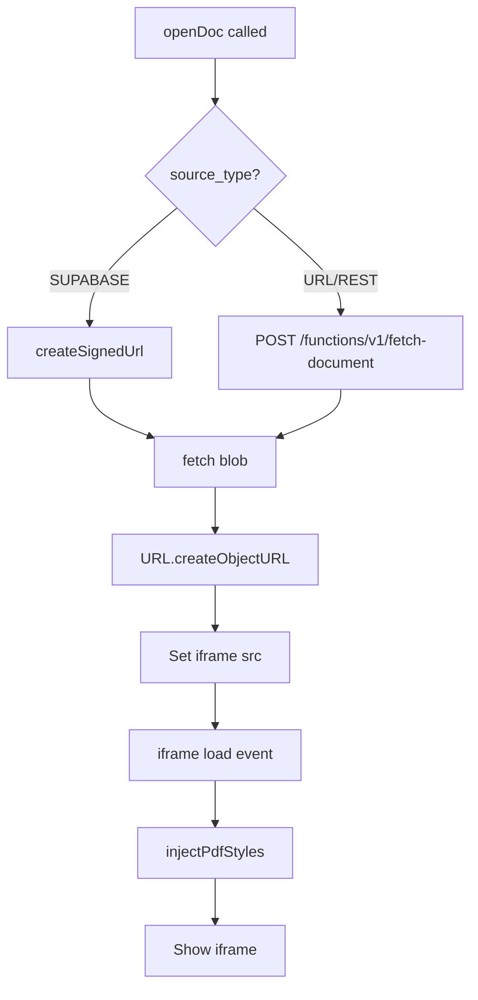

# Documents

**Files:** `pages/documents/index.html`, `pages/documents/documents.js`, `pages/documents/config.js`

Upload, browse, and view PDF documents. Supports Supabase storage and external sources.

## config.js

Maps logical names to actual database table/column names. **If the schema changes, update only `config.js`** — not `documents.js`.

```js
const DOC_CONFIG = {
  bucket: 'documents',
  signedUrlExpirySeconds: 60,

  tableDocs:    'ad_document',
  tableFiles:   'ad_document_file',
  colDocId:     'doc_id',
  colDocDesc:   'name',
  colCategoryId: 'category_id',
  // ...
  pdfViewerUrl: '../../assets/pdfjs/web/viewer.html',
};

const DOC_DEFAULT_FEATURES = {
  upload:     { enabled: true, dropZone: true, modalButton: true, promptOnDrop: true },
  delete:     { enabled: true },
  pdfViewer:  { defaultZoom: 'page-fit', defaultPanel: 'thumbs', showToolbar: true, showNavPanes: true },
  pdfButtons: { rotate: false, annotationEditor: false, print: true, download: true, ... }
};
```

`DOC_DEFAULT_FEATURES.pdfViewer` and `DOC_DEFAULT_FEATURES.pdfButtons` are **app-level config** — never overridden by user preferences. Only `upload` and `delete` sections can be customised per user.

## Key functions

| Function | Purpose |
|---|---|
| `loadDocuments()` | Fetches all docs for current org, renders the list |
| `loadDocFeatures()` | Merges user preferences into `DOC_FEATURES` (upload/delete only) |
| `applyDocFeatures()` | Shows/hides upload button, drop zone, delete button |
| `openDoc(docId)` | Selects a doc; fetches its file and loads the PDF viewer |
| `buildPdfHash()` | Builds the pdf.js URL hash (zoom, page mode, toolbar flags) |
| `injectPdfStyles()` | Injects CSS into the pdf.js iframe to hide unwanted toolbar buttons |
| `uploadAndSave()` | Uploads a file to Supabase storage and creates DB rows |
| `bindUpload()` | Wires the New Document modal |

## New Document modal — source types

| Source | `source_type` | Description |
|---|---|---|
| Upload file | `SUPABASE` | PDF uploaded to Supabase storage bucket |
| Google Drive | `URL` | Sharing URL auto-converted to direct download URL |
| Direct URL | `URL` | Publicly accessible PDF URL |
| REST API | `REST` | REST endpoint with optional auth |

For non-SUPABASE sources, the PDF is fetched via `POST /functions/v1/fetch-document`. See [fetch-document](../edge-functions/fetch-document.md).

## PDF loading flow


