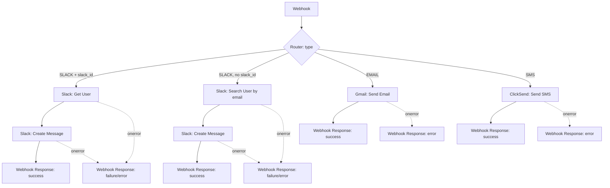

# Notifications

!!! warning "Prototype — not wired into approveDoc yet"
    This documents a working prototype, not a shipped feature. Nothing here is called from the approveDoc app or UI today. Two parallel send implementations exist behind an identical contract, built to compare a low-code (Make.com) approach against an in-house (Supabase Edge Function) approach — see [Decision status](#decision-status) below.

## Purpose

Recipients (and eventually their managers) need to be notified about required-reading documents — reminders before a deadline, escalations after one — across multiple channels (Slack, email, SMS; WhatsApp reserved for later), configurable per distribution, using reusable message templates.

The database side of this already exists: `ad_distribution_notification` (per-distribution rules — when, who, which channel) and `ad_distribution_item_notification` (the generated per-recipient instances, with `status`). See [Database Schema](../database/schema.md#notifications-prototype-see-notifications-feature-doc). Neither table is yet connected to the send implementations documented here — that integration is the main remaining piece.

## Shared contract

Both send implementations accept the same JSON and return the same response shape, so either can be called identically — switching between them is a URL change, not a rebuild.

**Request:**

```json
{
  "type": "SLACK",
  "firstname": "Mike",
  "lastname": "Ball",
  "email": "mike.ball@ionetiq.dev",
  "phone": "447789666369",
  "slack_id": "",
  "message_title": "Test message",
  "message_text": "Welcome to {firstname} {lastname}"
}
```

| Field | Notes |
|---|---|
| `type` | `SLACK`, `EMAIL`, or `SMS` (`WHATSAPP` reserved, not built) |
| `slack_id` | Optional. If present, validated and used directly. If blank, recipient is looked up by `email` |
| `phone` | Digits only, country code included, **no leading `+`** — both implementations prepend it |
| `message_text` | May contain `<b>`, `<strong>`, `<br>` and the tokens `{firstname}` / `{lastname}` — see [Per-channel formatting](#per-channel-formatting) |

**Response — three states, not two:**

```json
{ "success": true,  "status": "success", "message": "Notification sent" }
{ "success": false, "status": "failure", "error": "No Slack user found for that email" }
{ "success": false, "status": "error",   "error": "Failed to send Slack message: <reason>" }
```

`failure` = the message can't be sent as addressed (bad `slack_id`, no such Slack user, missing field) — a business-logic outcome, not a bug. `error` = the send attempt itself failed (API/config/network).

## Message templates

`ad_notification_template` (dev Supabase only) stores reusable `message_title` + `message_text` pairs with tokens left in place. Currently only wired into the two test pages (`tools/notification-webhook-test.html` for Make, and its `-direct` counterpart for the Edge Function) — **not** yet referenced by `ad_distribution_notification` or any approveDoc UI.

!!! danger "RLS is permissive, dev-only"
    `ad_notification_template` has RLS enabled but with a fully open `anon` policy (read/write/delete), so the test pages can hit it directly with the dev anon key. This must become org-scoped before any real UI touches it.

## Per-channel formatting

Templates are authored once in HTML; each channel adapts it on the way out:

| Channel | `<br>` | `<b>` / `<strong>` |
|---|---|---|
| Email | passed through (already valid HTML) | passed through |
| Slack | → real line break | → Slack `*bold*` syntax |
| SMS | → real line break | stripped (no SMS equivalent) |

## Implementation A — Make.com

- **Scenario:** `Slack - Webhook - Send message`, ID `7148833`, team `108032`, folder `ionetiq / Tools`
- **Webhook:** hook ID `3627525` — `https://hook.eu1.make.com/bf0nmo39qqfdky1zgr98wjr5wih4psa5`



Each route ends in its own `gateway:WebhookRespond` — Make has no join point across parallel router branches, so every branch must terminate the HTTP response itself.

**Connections:**

| Channel | Connection |
|---|---|
| Slack | "Slack - approveDoc" (ionetiq.slack.com) |
| Email | Google connection `6112014` — note: despite the module being `google-email:ActionSendEmail`, it required an `account:google` connection (not the dedicated `google-email` ones), since those lacked the `mail.google.com` scope this module needs |
| SMS | "ClickSend SMS" connection `3428156` |

!!! note "IML gotchas hit while building this"
    - `replace()` nesting must balance exactly — N substitutions needs N nested calls and N closing parens; a miscount throws `Unclosed function at position N` with no hint of which paren.
    - `\n` inside an IML string literal is two literal characters, not a newline. Getting an actual line break requires embedding a real newline byte in the field (via a JSON `\n` escape at the API layer), not the two-character sequence.
    - Editing a scenario via the API sets it inactive/unlinked each time — needs re-activating after every blueprint update.
    - A stale browser tab overwrites API-side fixes: if the scenario is open in the Make UI while also being edited via API, hitting Save there resubmits the tab's local buffer, silently reverting the API fix.

## Implementation B — Supabase Edge Function

- **Function:** `send-notification-direct` — deployed to **dev only** (`mimqaklxfmdjlkadjxoh`), not wired into the nightly cron
- No router needed — plain `if` branches per `type`, calling each provider's REST API directly (Slack Web API, Resend, ClickSend)
- HTML→channel conversion uses real regex rather than Make's chained `replace()` calls
- Every failure path returns the **actual provider error text**, not a generic message — see [send-notification-direct](../edge-functions/send-notification-direct.md) for the full reference including required secrets and a real setup gotcha (Slack's `messages_tab_disabled`) this surfaced.

## Decision status

Make was built first to prove the contract and template idea out fast. The Edge Function version followed, to evaluate moving in-house — because the **nightly cron already exists** (`pg_cron` → `trigger_send_due_notifications()` → Edge Function `send-due-notifications`) and today it just proxies to the Make webhook to actually send. Folding the Edge Function's logic into `send-due-notifications` removes Make as a hop entirely, rather than replacing a working system from scratch.

**Current lean: the Edge Function**, once the integration work below is done. Trade-off: Make's connections were "click to authorize"; the Edge Function needed its own bot token / API keys set up from scratch per provider.

## Outstanding work

- [ ] **Multi-tenancy** — both implementations use one set of credentials. Each org will eventually need its own Slack app/bot token, sending domain, SMS account — likely a per-org credentials table with RLS.
- [ ] Move `ad_notification_template` RLS from permissive `anon` to org-scoped
- [ ] Wire `ad_distribution_notification` / `ad_distribution_item_notification` to actually call one of these implementations, and reference templates by ID
- [ ] Build the "pick a template" admin UI in approveDoc
- [ ] Expand tokens beyond `{firstname}`/`{lastname}` (document name, due date, distribution name, etc.)
- [ ] Track delivery status back onto `ad_distribution_item_notification.status`
- [ ] Decommission the Make scenario once the Edge Function is proven in production
