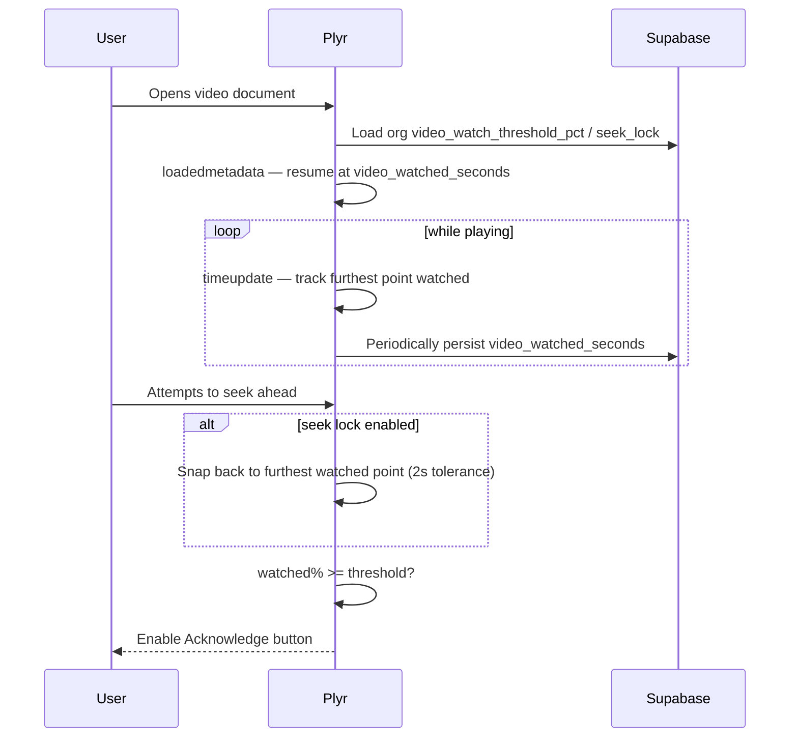

# Video Compliance

Enforces that a recipient actually watches a video document (not just opens it) before they can Acknowledge it — configurable per organisation.

## Settings

Two org-wide settings on `organisations`, editable by `admin`/`super_admin` via the **Preferences modal**'s Video tab (not a dedicated admin page):

| Column | Type | Default | Meaning |
|---|---|---|---|
| `video_watch_threshold_pct` | integer, 1–100 | `100` | % of the video that must be watched before Acknowledge is enabled |
| `video_seek_lock_enabled` | boolean | `true` | If true, users can't skip ahead of the furthest point they've watched (rewatching earlier sections is always fine) |

Saved via a `SECURITY DEFINER` RPC, `update_video_compliance_settings(p_watch_pct, p_seek_lock)`, rather than a direct table update — `organisations` UPDATE is otherwise restricted to `super_admin` by RLS, and this function checks the caller's role itself (`admin` or `super_admin`) and only ever touches these two columns on the caller's own org. Same pattern used elsewhere for admin-level settings that don't warrant loosening the base RLS policy.

## Per-user progress

Two columns on `ad_distribution_item`:

| Column | Meaning |
|---|---|
| `video_watched_seconds` | Furthest point (seconds) this user has watched into the video |
| `video_duration_seconds` | Total video duration, captured on first playback |

Watched % is `video_watched_seconds / video_duration_seconds * 100`, compared against the org's `video_watch_threshold_pct`.

## Supported formats

Detected by MIME type / URL pattern in `documents.js`:

| Source | Detected as |
|---|---|
| `.mp4` | `video/mp4` |
| `.webm` | `video/webm` |
| `.mov` | `video/quicktime` |
| youtube.com / youtu.be URLs | `video/youtube` |
| vimeo.com URLs | `video/vimeo` |

Any MIME type starting `video/` or `audio/` routes to the video viewer instead of the PDF viewer.

## Player

[Plyr](https://plyr.io) (loaded from jsDelivr), used in two places with near-identical wiring:

- **Documents admin page** (`documents.js`) — preview only, no compliance gating (admins previewing a document aren't "acknowledging" it)
- **Acknowledge page** (`acknowledge.html`) — the real gate, described below

Native files (`mp4`/`webm`/`mov`) play directly via `<video>`; YouTube/Vimeo use Plyr's embed mode via a `plyr__video-embed` div.

## Compliance gating (Acknowledge page)

Key behaviours in `acknowledge.html`:

- **Resume**: on `loadedmetadata`, if there's a saved `video_watched_seconds` less than the duration, playback jumps there rather than starting from zero.
- **Progress tracking**: on `timeupdate`, if the current position exceeds the furthest previously watched, that becomes the new high-water mark, and a save is scheduled (debounced, not on every tick).
- **Seek lock**: on `seeking`, if enabled and the user has jumped more than 2 seconds past their furthest watched point, playback is snapped back. The 2-second tolerance accounts for buffering/rounding, not a real skip-ahead.
- **Save points**: progress is persisted on `pause` and `ended`, not continuously — avoids hammering the DB on every `timeupdate` tick.
- **Gate**: the Acknowledge button is disabled (with an explanatory label showing the required %) until watched% meets the org's threshold. Non-video documents are never affected by this gate.
- **Already-compliant sessions**: if a user returns after already meeting the threshold in an earlier session, the gate doesn't re-block them.

## Where it doesn't apply

Only the Acknowledge flow gates on this. The Documents admin page's video preview is unrestricted — it's for admins checking content, not recipients completing a requirement.
