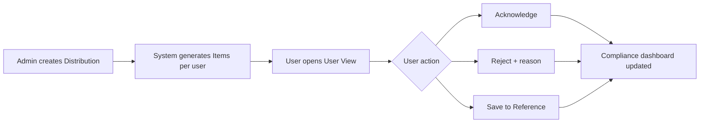

# approveDoc Developer Documentation

**approveDoc** is a cloud-native document acknowledgement and compliance platform built by [ionetiq](https://ionetiq.dev).

## What it does

approveDoc enables organisations to:

- Distribute required-reading documents (policies, procedures, compliance materials) to their workforce
- Track acknowledgement, rejections, and reference saves per user
- Enforce deadlines and generate real-time compliance visibility
- Support external document repositories (Google Drive, REST APIs, etc.)

## Core workflow

## Stack

| Layer | Technology |
|---|---|
| Frontend | Tabler UI + Bootstrap 5.3 + Vanilla JS |
| Backend | Supabase (PostgreSQL + Auth + Storage + Edge Functions) |
| Hosting | Static site — GitHub Actions FTP deploy to `ionetiq.dev`/`approvedoc.app`. No specific server software required |
| Source control | GitHub (`ionetiqdev/approveDoc`) |

## Quick links

- [Architecture Overview](architecture/overview.md)
- [JS Modules](modules/supabase-client.md)
- [Database Schema](database/schema.md)
- [Deployment](deployment/deploy-bat.md)
- [Patterns & Conventions](guides/patterns.md)

---

!!! note "Version"
    These docs cover approveDoc v1.0. Build timestamp is updated automatically on each deploy.
